# Target Information

  **Date**         01/05/2021
  **Name**         FunboxRookie
  **Difficulty**   Easy
  **Location**     [Offensive Security Proving Grounds](https://www.offensive-security.com/labs/)
  **Author**       [Cyberheisen](https://www.twitter.com/cyberheisen)

# [Obligatory Disclaimer]

The tools and techniques described in this material are meant for
educational purposes. Their use on targets without obtaining prior
consent is illegal and it is your responsibility to understand and
follow any applicable local, state, and federal laws. Any liability
because of your actions is yours alone.

Any views and opinions expressed in this document are my own.

# [Walkthrough]

We start with our AutoRecon scans, specifically we want to get the quick
TCP results

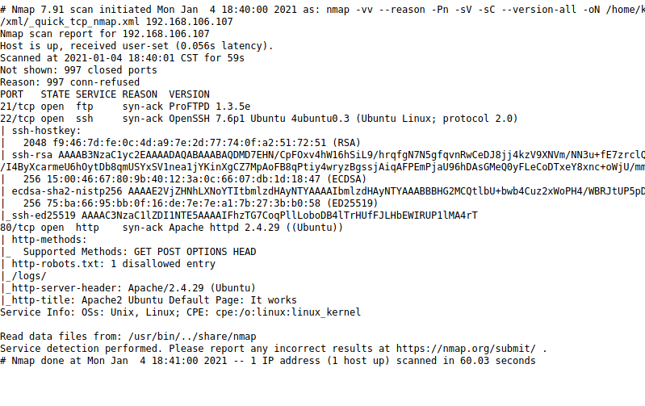

 

It looks like we have 21 FTP, 22 SSH, and 80 HTTP open. Let\'s look at
FTP first since that\'s generally an easy 'in' if left to its default
configuration. We\'ll try logging in as anonymous.

 

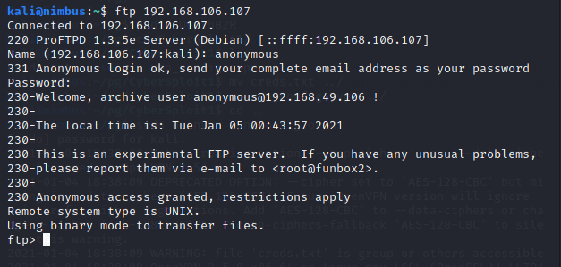

 

Anonymous access is permitted and we\'re in.

 

 

Great Scott! Look at all those zip files! Let\'s pull them down.

 

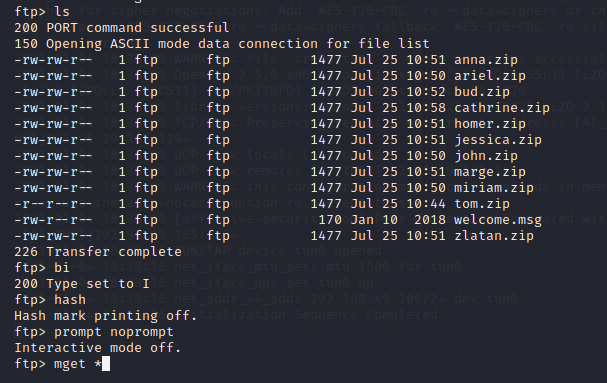

 

A quick run-down on my ftp commands.

-   bi sets the mode to binary, since we\'re downloading binary files.

-   hash gives us an indicator for file progress. It\'s optional here,
    > but it\'s something I\'m used to doing.

-   prompt noprompt prevents the ftp client from asking us if we want to
    > download each individual file. Learn this one, you\'ll thank me
    > later.

-   mget \* - multiple file get - grab all the files in the folder.

 

Now that we have all the files, let\'s dig into them. I\'m going to
start with the welcome.msg file and then we\'ll uncompressed the others
and see what we have.

 

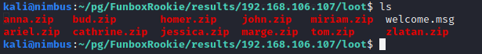

 

Ok, nothing in the msg file - just the FTP banner message we saw
earlier.

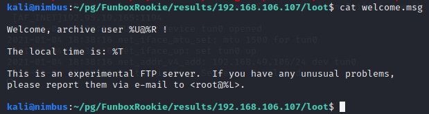

 Looks like the files are password protected.

 

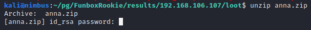

Let\'s pause there for a moment and look at the web port.

 

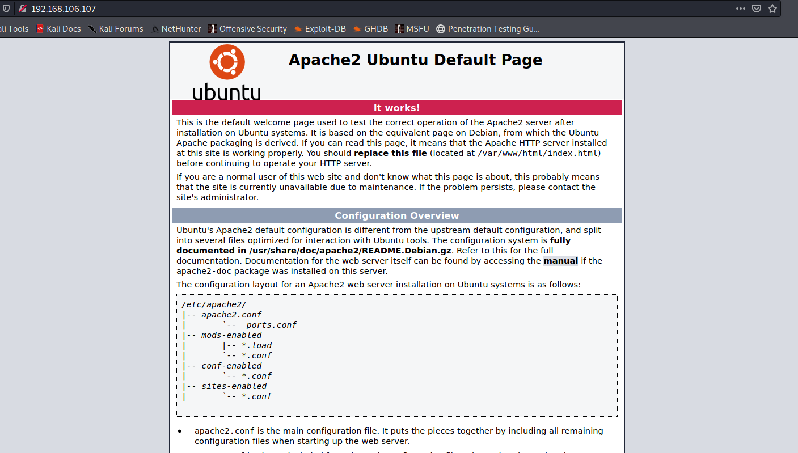

 

 

It\'s the default page for Ubuntu Apache. Kind of boring. Normally at
this stage, I would run dirb or gobuster to check for any \'hidden\' web
sites, but Autorecon should have done some of that for us. Let\'s look
at the results.

 

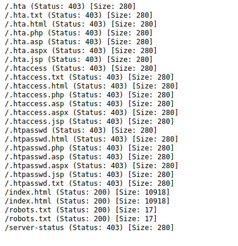

We\'re interested in any status:200 messages. Nothing extraordinary
here. The robots.txt file has a single line telling the search engines
to not index the /log/ folder (which also does not exist).

 

By now the full nmap scan kicked off by AutoRecon has finished. There
wasn\'t anything new.

 

Let\'s take a closer look at the ftp version. Perhaps ProFTPD 1.3.5e has
a known vulnerability we can dig into?

 

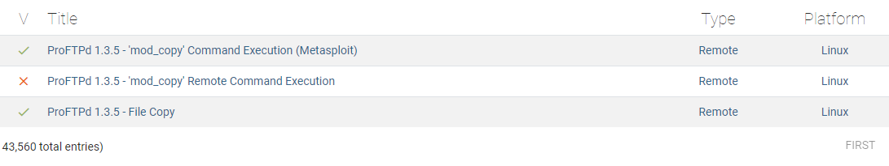

The \'mod_copy\' remote command execution looks like what we would need.
There\'s a Metasploit module available, but we\'re going to try and do
it old school.

The manual exploit is written in python, and from the looks of it, we
should be able to run the code and pass it the server name, a directory,
and a command. Let\'s see if we can get it to work.

 

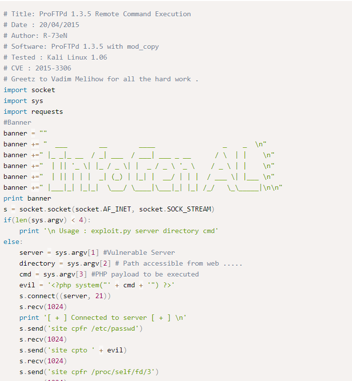}

 

By the way, it\'s generally good practice to review and \*try\* to
understand exploit code before executing it. When working in the real
world, the last thing you want to do is introduce malware into the
target.

 

 Let's download and try running it.

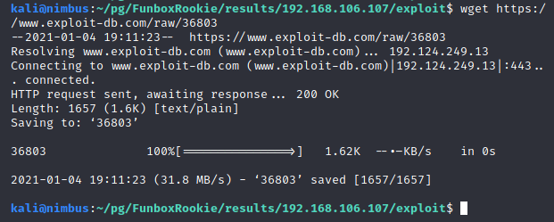

 

Running the command hangs at the \"Connected to server\" message from
the script. It\'s a no-go.

 

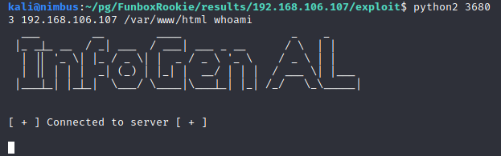

 

Taking another look at the script, it seems it\'s issuing \"SITE cpfr\"
and \"SITE cpto\" commands to copy files. Let\'s validate our service is
vulnerable by running the commands manually and reviewing the output.

 

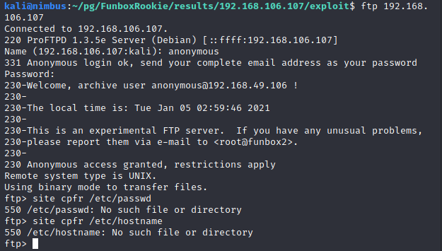

 

It doesn\'t appear as though we can access files outside the ftp root
folder. Without that functionality, this exploit is toast and the
vulnerability we found is likely not applicable in this case.

 

As we've reached a dead end, it\'s time to summarize what we have:

 

-   An ftp service allowing anonymous access that does not appear to be
    > vulnerable to a known vulnerability

-   Multiple password protected ZIP archives

-   A default instance of Apache2 for Ubuntu

-   No additional web directories

 

It seems the only thing left to do is re-visit those zip archives and
see if we can crack the password.

 

We\'ll use John the Ripper for this. The first step is to extract the
password hashes from the zip archives. We can do this using zip2john and
a simple bash loop:

"for i in \$(ls \*.zip); do zip2john \$i \>\> hashes; done"

For anyone new to bash scripting, here's what this means.

for i in \$(ls \*.zip); \# list the zip files in the directory and
assign the value if 'i' to the filename

do zip2john \$i \>\> hashes; \#for each zip file, run zip2john and
append the contents into a new file called hashes

done \# this is the end of the loop

 

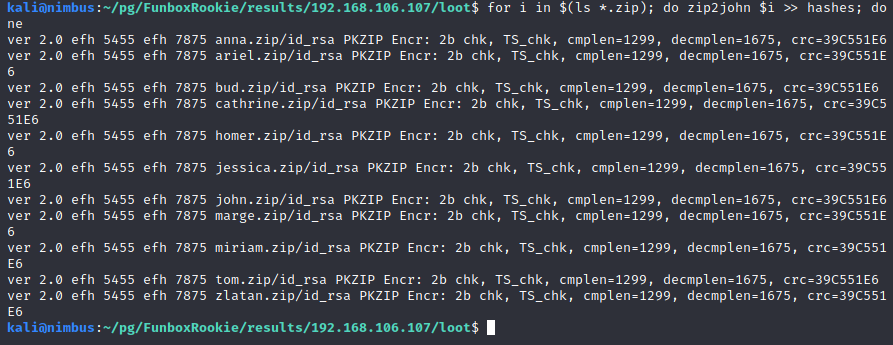

>  

Now let\'s run john against the hashes. We\'ll use rockyou.txt, arguably
the most common wordlist used for password cracking these days. It\'s by
no means the best, but it will take care of most common and simple
passwords in a short time frame.

 

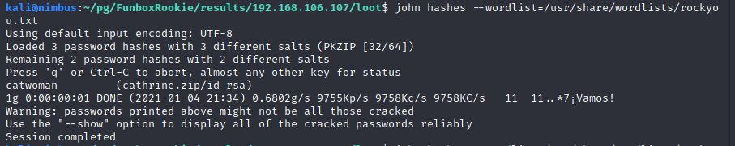

We have a password! Heading the "Warning", we'll double check with the
\--show command as suggested.

 

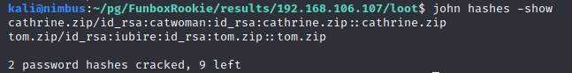

 

Oh! We have 2 passwords! Ok, let\'s see what\'s in the archives!

 

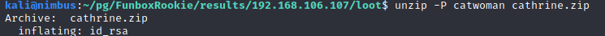

 

 

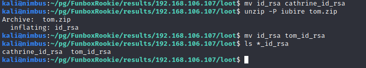

 

It looks like we have some private keys! Private keys are as good as
passwords and if they haven't been protected with a password themselves,
we may be able to use them to connect remotely to the target through
SSH.

 

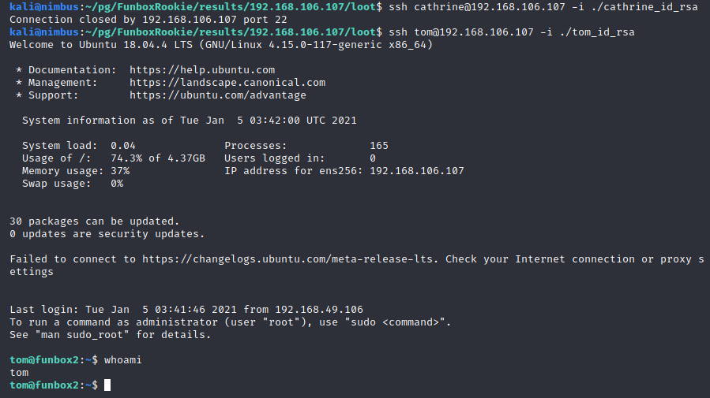

 

Cathrine\'s login was a no-go, but Tom\'s was successful!

 

And in Tom's home directory, we find the local.txt:

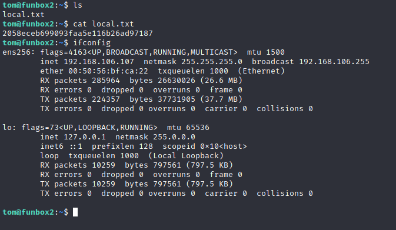

 

Now it\'s time to escalate our privilege and see about grabbing the
proof.txt file from root!

 

The first thing I notice is that we\'re restricted to our home
directory. We can view files outside our home directory, but we can\'t
change directories. We're likely stuck in a restricted shell.

 

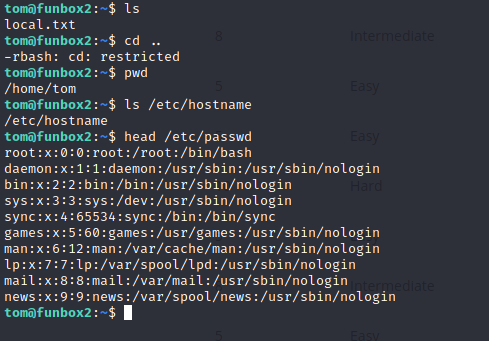

 

A check for SUIDs (find . -perm /4000) didn\'t turn up anything useful.

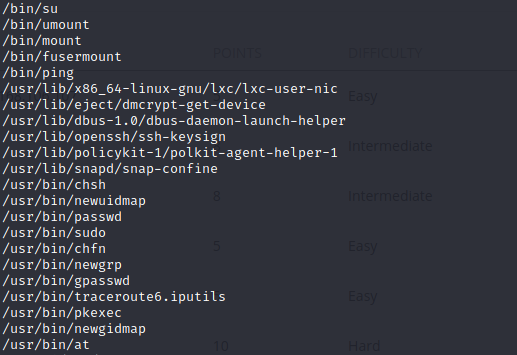
 

What version of Linux are we running?

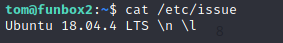

 

A quick search on exploit-db produces one privilege escalation exploit.

 

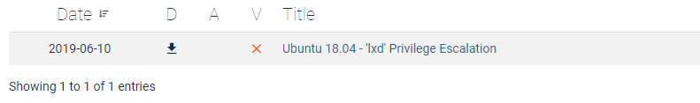

The code didn\'t really explain what was happening, so I did a quick
Google search on \'lxd privilege escalation\" and found an
[article](https://www.hackingarticles.in/lxd-privilege-escalation/) on
the vulnerability. Essentially, if a user is a member of the \'lxd\'
group, they can instantly escalate privileges to root without passwords
and regardless of any granted SUDO rights.

 

Let\'s see who is in our target machine\'s \'lxd\' group

 

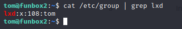

 

That\'s convenient! I think we need to continuing pulling on this
thread.

 

Let\'s see if we can get the exploit to work.

 

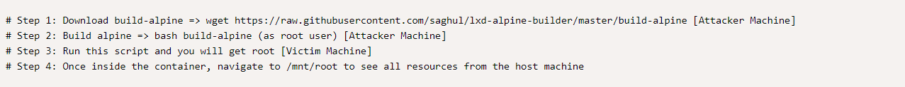

 

 

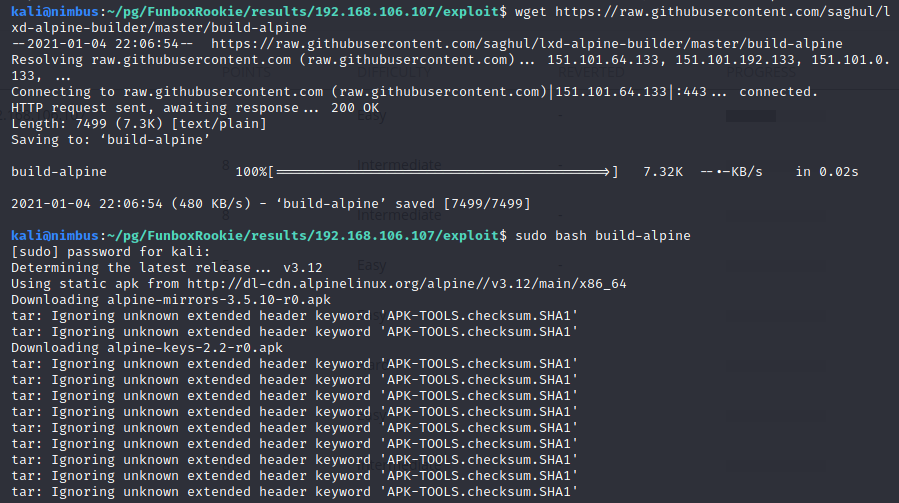

 

We end up with a tar.gz file that we need to transfer over to the target
machine along with the bash script.

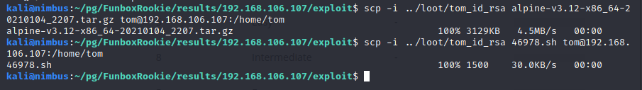

 

I tried to run the script, but the restricted shell kicked it back.

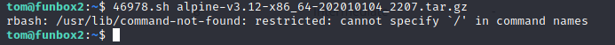
 

We need to get rid of the restricted shell. Let\'s try executing a new
shell and if we\'re lucky...\...

 

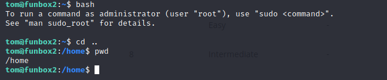

 

It's *rarely* that easy, but in this instance, we\'ve broken free!

 

Now to run the script.

 

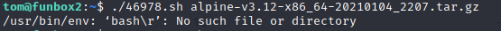

 

No good - we got an error. Looks like our bash is reading in the return
character ( \"\\r\") in the first line of the script. We need to remove
it.

 

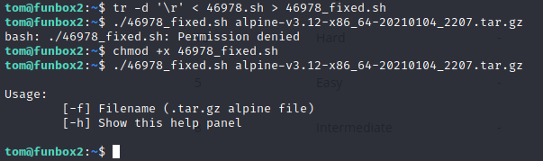

 

Now that we have removed it and made the fixed copy executable with
chmod +x, the script is able to run. We need to add the -f switch as
part of the command and we should be good.

 

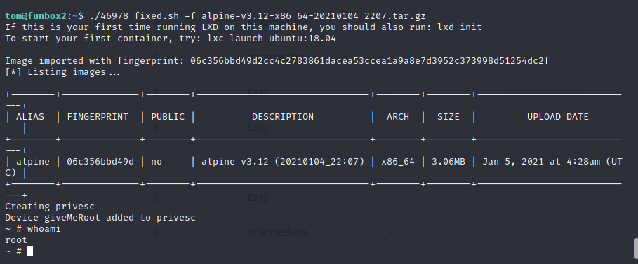

 

We have root. Let\'s grab the proof.txt

 

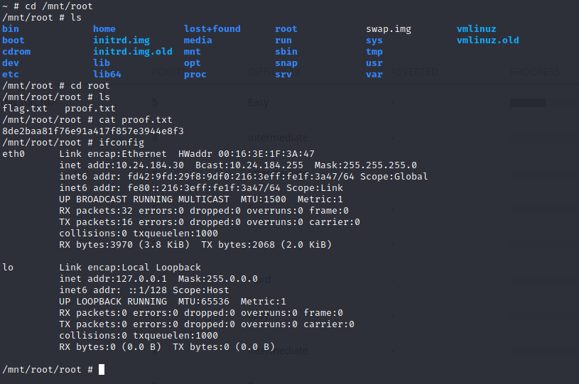

# [Conclusion]

FunboxRookie lived up to its name. It's always fun finding loot with
sensitive information, as we did with the private keys hosted on the
anonymous FTP server. It wasn't a terribly difficult box, but admittedly
I spent too much time chasing the ProFTPd mod_copy vulnerability rabbit
hole. The quicker way to obtain the initial foothold into the system
would have been cracking the zip file passwords. However, in my
real-world experience it's not often you find a protected file that's
super easy to crack. Not to say it doesn't happen, but it is rare.
Still, it would have been a more efficient use of time to initiate the
password crack when we found the zip files and left it to run in the
background while we continued investigating other possibilities.

Many thanks to [0815R2d2](https://twitter.com/0815R2d2) for putting
together this challenge!

# [FLAGS]

Flags are reportedly generated dynamically when the target is reset, so
the flags below will be different on each run.

  **local.txt**:   2058eceb699093faa5e116b26ad97187  
  **proof.txt**:   8de2baa81f76e91a417f857e3944e8f3  

# [Commands and Tools Used]

  |**Name**|**Description**|**How it was used**|
  |---|---|---|  
  |[AutoRecon](https://github.com/Tib3rius/AutoRecon)|   AutoRecon is a multi-threaded network reconnaissance tool which performs automated enumeration of services. It is intended as a time-saving tool for use in CTFs and other penetration testing environments (e.g., OSCP). It may also be useful in real-world engagements.|   Used to do the initial enumeration discovery of the target.|
  |chmod|Modified files permissions in Linux|Used to add the "Execute" property to the exploit script.|
  |[curl](https://curl.se/)|Command line tool and library for transferring data with URLs|Used to download exploit code to target.|
  |find|search for files in a directory hierarchy (Linux)|Used to search for executables with the SUID bit enabled for privilege escalation as root.|
  |[gobuster](https://github.com/OJ/gobuster)|URI and DNS Subdomains brute force tool|Used as part of the [AutoRecon](https://github.com/Tib3rius/AutoRecon) script to brute force potential files and directories at the URI.|
  |[John the Ripper](https://www.openwall.com/john/)|Password cracking and brute force tool|Used to crack the password from the compressed PKZIP archive files.|
  |ssh |Secure Shell|Used to log into the target.|
  |[Firefox](https://firefox.com)|Web browser|Used to view the web site served on the target.|
  |[zip2john](https://www.openwall.com/john/)|PKZIP archive password hash exporter|Used to extract the password hashes from the PKZIP archive files. Part of the John the Ripper package.|
