# Target Information

  **Date**:        01/05/2021  
  **Name**:         SunsetNoontide  
  **Difficulty**:   Easy  
  **Location**:     [Offensive Security Proving Grounds](https://www.offensive-security.com/labs/)  
  **Author**:       [Cyberheisen](https://www.twitter.com/cyberheisen)  

# [Obligatory Disclaimer]

The tools and techniques described in this material are meant for
educational purposes. Their use on targets without obtaining prior
consent is illegal and it is your responsibility to understand and
follow any applicable local, state, and federal laws. Any liability
because of your actions is yours alone.

Any views and opinions expressed in this document are my own.

# [Walkthrough]

 As always, we start with `AutoRecon`. The nmap scan shows we have a
single port running - IRC at 6667

 

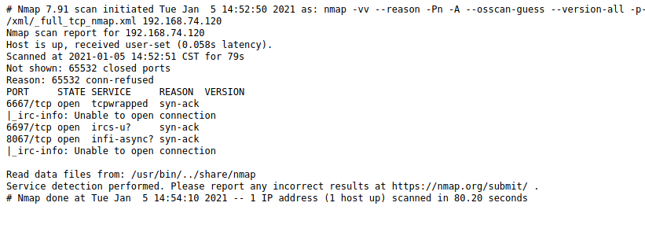
Let\'s see if there are any nmap scripts we could run to get more
information.

 

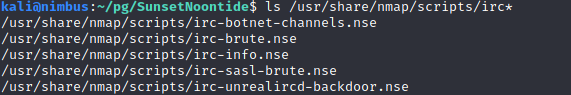

 

Woah... that `UnrealiRCd-backdoor` looks like something we could totally
use.

 

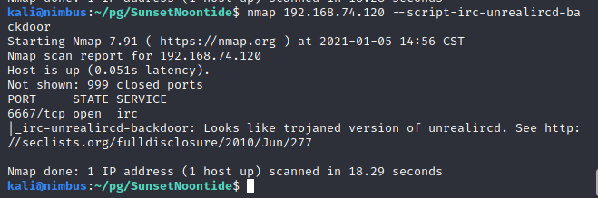
 

Groovy! Let\'s check the link and read the details. Here\'s the
important information.

 

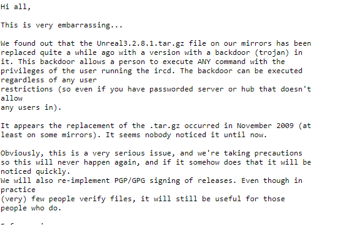

 

I did a little research to see how we could exploit this and came across
a code snippet, which was pulled from the very nmap script we ran.

 

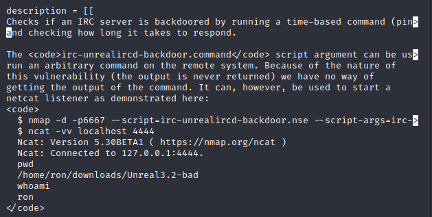
 

Let\'s try running it like it shows in the script.

 

A couple things need to be configured first. We're going to modify the
nmap script argument slightly, so we get a reverse shell back to our
listener, rather than a bind shell as listed. We\'ll also need a netcat
listener running before we execute the nmap command and we\'ll need a
location to store the netcat binary where our target can access it via
http. Let's launch the listener.

 

 

For the target\'s netcat binary, we need to know what operating system
is running on the target. Nmap didn\'t give us a solid answer, but from
the TCP fingerprint, it looks like a Linux kernel is running, so we\'ll
go with that.

 

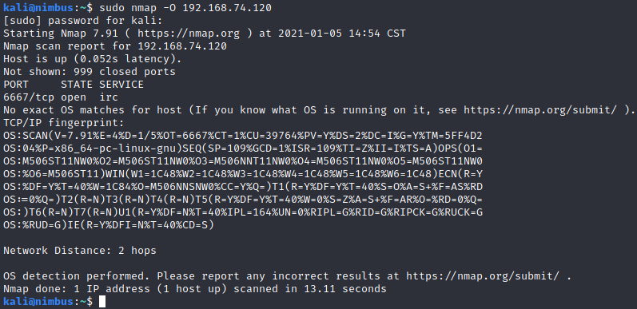

 

Whenever I do these challenges, I create a folder for each target and
start a web service running at the root. We\'ll drop our netcat binary
in that folder and instruct the target to download it.

 

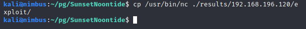
 

Let\'s breakdown the nmap command:

 

-d gives us some extra debugging

-p is our destination port

\--script is the nmap script we\'ll run

\--script-args are the arguments we\'ll pass along to the script. Inside
the arguments are commands to download nc from our webserver, make it
executable, and then connect back to our netcat listener.

 

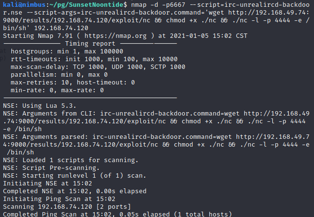
 

Lots of scrolling text, but the reverse shell didn\'t work. No hits on
our web server either. I spent a lot of time trying to troubleshoot why
it didn't work, but we'll talk more about that in the conclusion.

 

I did a little research online and came across a slightly different nmap
command whereby the only script arguments passed was the netcat reverse
shell command. This version of the command assumes nc is already
available on the target machine. Let\'s give it a go.

 

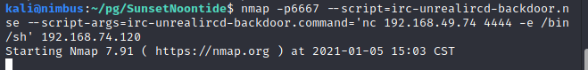
 

This time it works, and we have a shell.

 

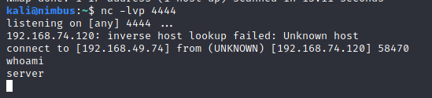
 

 

Here's the `local.txt`

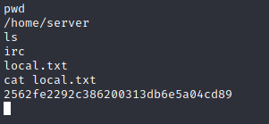

  

Unfortunately, it\'s a lousy non-interactive terminal. The python shell
upgrade trick didn\'t work....

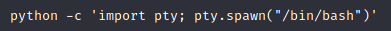

 

So let\'s try another method.

 

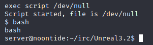

 

Thanks goodness!

 

Time to escalate privileges.

 

SUIDs are a no-go.

 

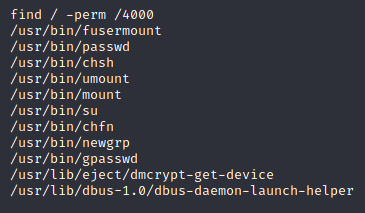

 

Lots of files in the /home/server/irc/Unreal3.2 directory. Let\'s look
for passwords in config files.

 

Running a grep -I pass\* \* in the folder returns multiple hits, but
nothing that works.

 

We could go the kernel exploit method, but let\'s try a few more basic
items.

 

Maybe we can guess the password?

 

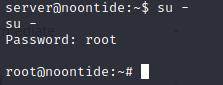

 

First try...

 

 Let's grab our `proof.txt` and we're done.

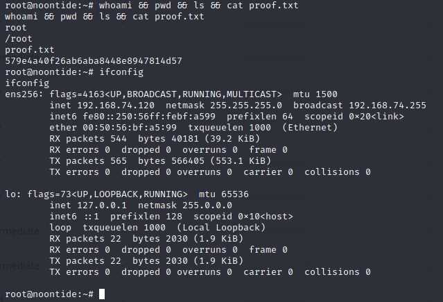

# [Conclusion]

I found SunsetNoontide frustrating. Not because of its difficulty,
rather the commands I felt should have worked didn't. When the nmap
script failed, I spent some time troubleshooting trying to understand
where the disconnect was. At one point, I had only had the wget portion
in the arguments and it still failed. I tried the Metasploit module for
the exploit and it worked without problems, so I knew the issue was with
the specific way the nmap script was handling the exploit. To make sure
we didn't break anything earlier, I reverted the server and started
again. In the end, the solution that worked was avoiding downloading the
netcat binary altogether and using the one on the machine.

After all that work, I was also disappointed with the privilege
escalation to root. The author provided a clue in the description to
"not overthink" so I felt it was likely something like a password in a
file or a simple password being used rather than an exploit.

Thanks [\@whitecrowz](https://twitter.com/@whitecr0wz) for putting this
challenge together!

# [FLAGS]

Flags are reportedly generated dynamically when the target is reset, so
the flags below will be different on each run.

  **local.txt**:   2562fe2292c386200313db6e5a04cd89  
  **proof.txt**:   579e4a40f26ab6aba8448e8947814d57  

# [Commands and Tools Used]

  |**Name**|**Description**|**How it was used**|
  |---|---|---|
  |[AutoRecon](https://github.com/Tib3rius/AutoRecon)|   AutoRecon is a multi-threaded network reconnaissance tool which performs automated enumeration of services. It is intended as a time-saving tool for use in CTFs and other penetration testing environments (e.g. OSCP). It may also be useful in real-world engagements.  | Used to do the initial enumeration discovery of the target.|
 |find|search for files in a directory hierarchy (Linux)|Used to search for executables with the SUID bit enabled for privilege escalation as root.|
  |[netcat](http://netcat.sourceforge.net/)|Simple tool for reading and writing data using TCP|Used to establish a reverse shell from the target to the attacker machine.|
  |[nmap](https://nmap.org)|Security scanner tool for vulnerability scanning and network discovery|Used to scan the IRC port and run the IRC backdoor exploit.|
