# Target Information

  **Date**: 01/06/2021  
  **Name**:         loly  
  **Difficulty**:   Intermediate  
  **Location**:     [Offensive Security Proving Grounds](https://www.offensive-security.com/labs/)  
  **Author**:       [Cyberheisen](https://www.twitter.com/cyberheisen)  

# [Obligatory Disclaimer]

The tools and techniques described in this material are meant for
educational purposes. Their use on targets without obtaining prior
consent is illegal and it is your responsibility to understand and
follow any applicable local, state, and federal laws. Any liability
because of your actions is yours alone.

Any views and opinions expressed in this document are my own.

# [Walkthrough]

 Starting with an Nmap quick scan results from AutoRecon

Anything good on gobuster?

If we go to /wordpress, we find a WordPress site, but the links don\'t
work as it points to a domain name loly.lc, rather than the ip address.

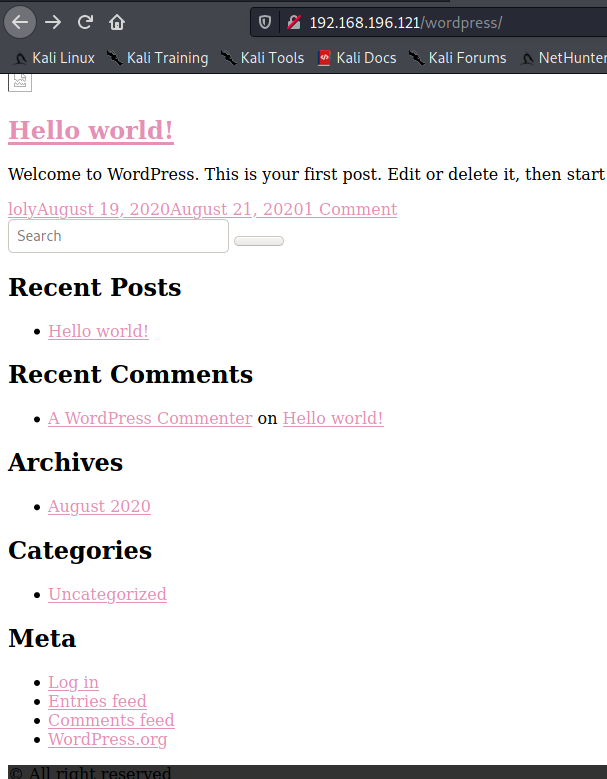

We can easily fix that by entering a static hostname entry in our hosts
file. We make a copy of our original host first, make the change, and
then put the updated hosts file back in /etc

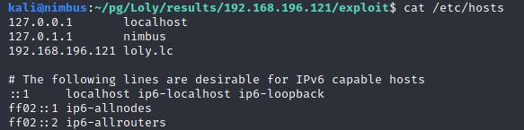

Now we have a working website.

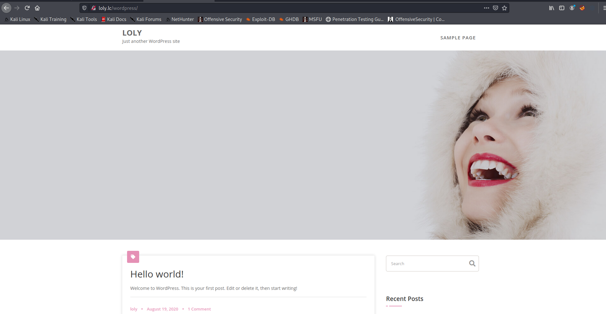

First thing we do is head over to /wp-admin and try logging in with the
default WordPress credentials. It fails, but hey... we tried!
 

The WordPress site looks default. We can run wpscan to look for any
vulnerabilities or configuration issues we can leverage.
 

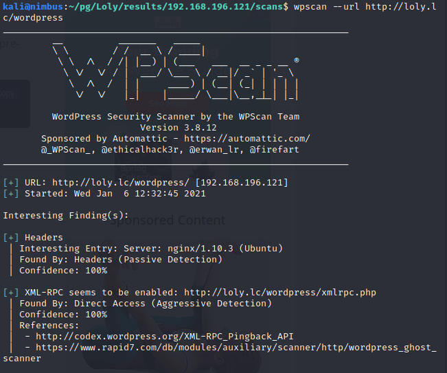

 
Wpscan tells us we\'re looking at WordPress 5.5 with 8 known
vulnerabilities. Let\'s see if we can use any of those.
 

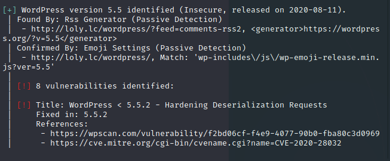
 

CVE-2020-28037 was the best looking vulnerability for us, but after
researching it a bit, it didn\'t seem feasible.
 

Next step, let\'s try to enumerate users. We do this with the
\--enumerate u argument.

 
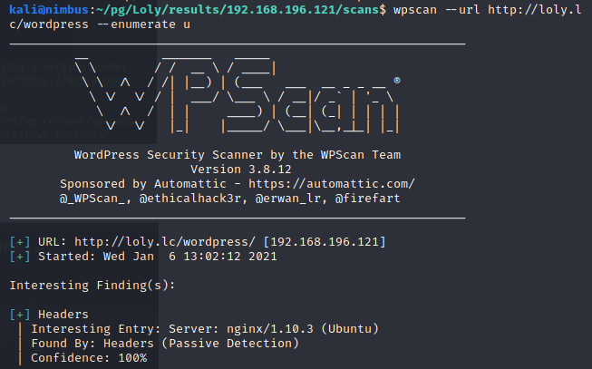
 

We found a user: loly!
 

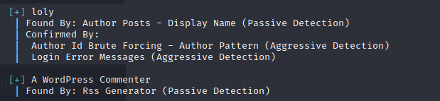

 
Now lets run a password brute force attack against Wordpress.

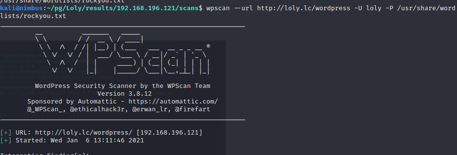

We found a valid password: fernando

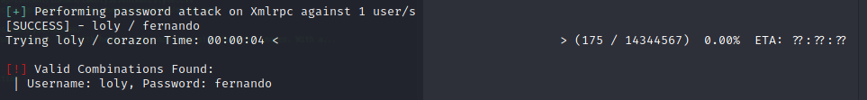

Now we try to login to the admin dashboard using these creds... And
we\'re in!

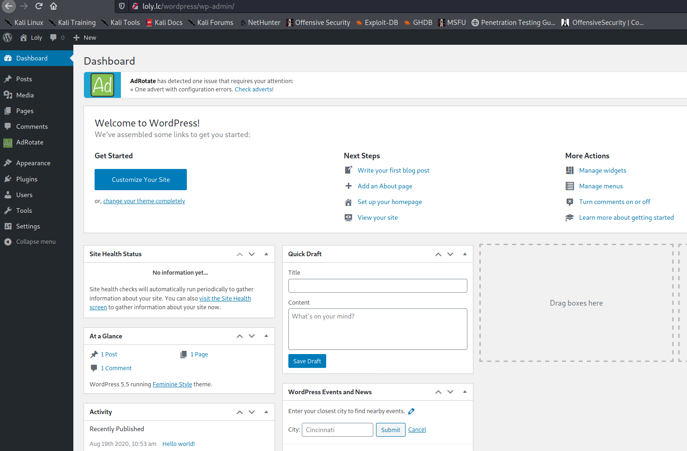

So we know that the version of WordPress we\'re running has
vulnerabilities, but nothing we can really use to do an RCE. Let\'s look
at the plugins and see if any are vulnerable.

We have three plugins. I believe Hello dolly and Akismet Anti-Spam are
included with WordPress, so let\'s research AdRotate and see if there\'s
anything there.

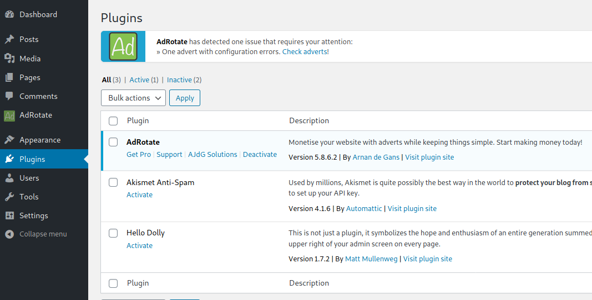

Looking through the AdRotate settings, I find an upload file function
that may be helpful.

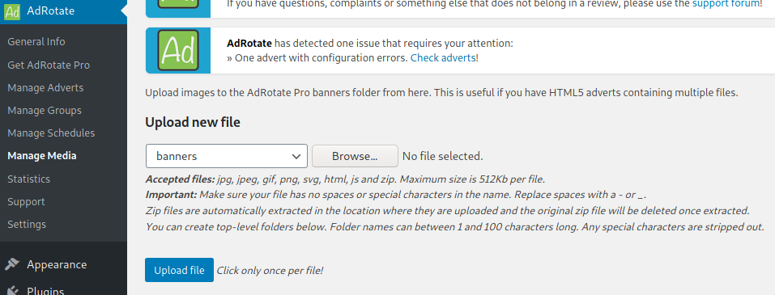

It won\'t accept php, but it will accept zip, and the zip files are
automatically extracted. Let\'s see if we can upload a php shell.

We\'re going to try the php-reverse-shell.php file, located in
/usr/share/webshells/php folder in the kali distribution.

We update the php-reverse-shell.php code with our IP address.

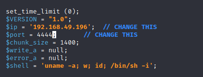

And we zip and upload.

\`Zip shell.zip php-reverse-shell.php\`

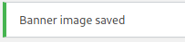

Let\'s get a listener going and try to grab the shell.

The file would have been uploaded to /wordpress/wp-content/banners/ as
per the AdRotate settings.

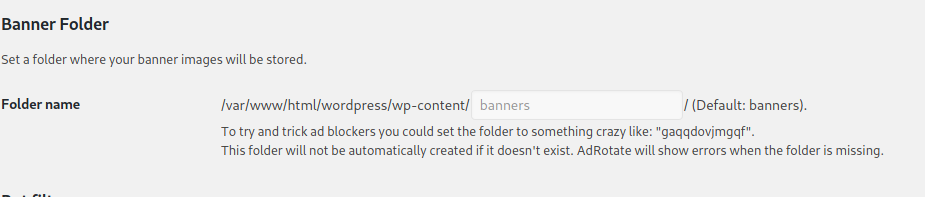

We hit the url

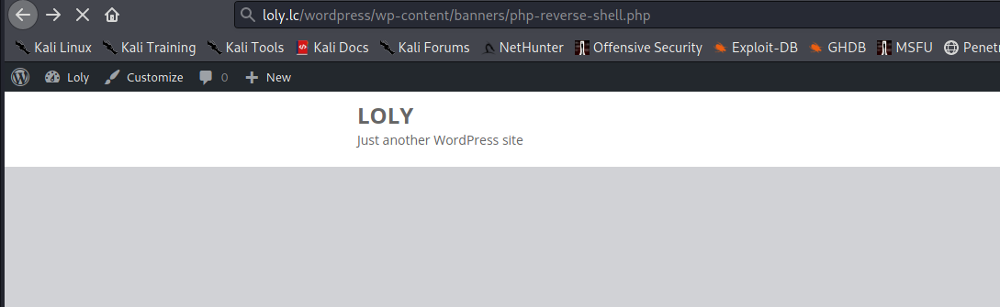

And we have a shell!

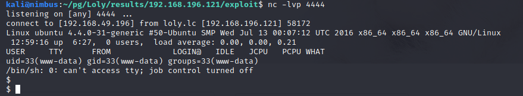

Grabbed the local.txt

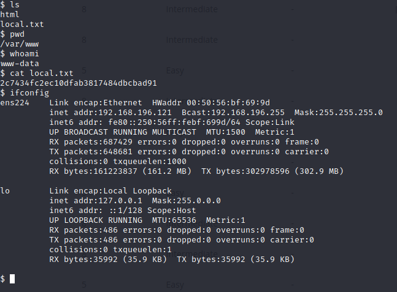

We're still working with a basic shell, so before we continue, let\'s
upgrade it.

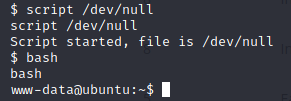
 
Terminal upgraded. Any SUIDs we could exploit?

Nope.
 
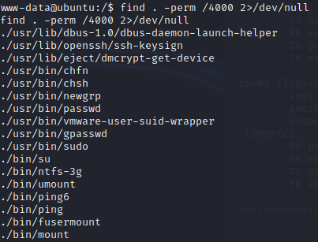

Let\'s see if our kernel is vulnerable...

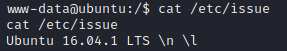

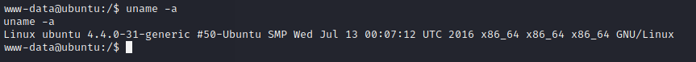

Ubuntu 16.04.1 running Kernel 4.4.0-31.

A quick search on exploit-db.com leads me to CVE-2017-16995 -- Local
Privilege Escalation for Linux Kernel \< 4.13.9 Tested on Ubuntu 16.04.

We download and compile it. We'll use the same file upload method we
used to upload our shell, so we need to zip the exploit. 

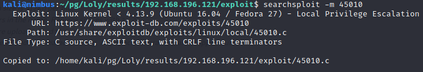

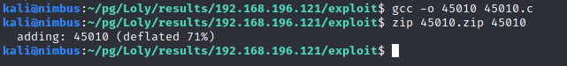

 Now that we have it on the server, we'll make it executable and run it.

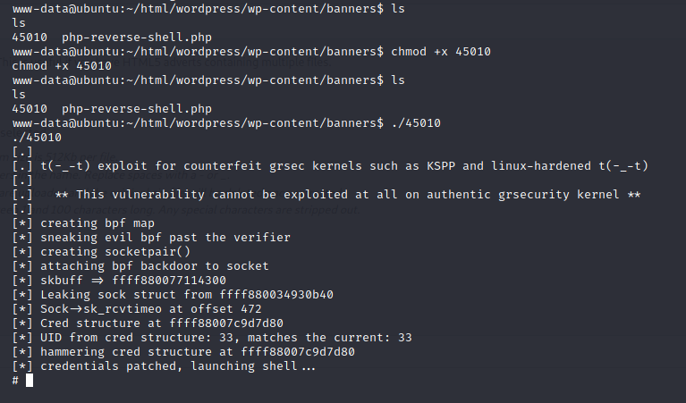

We have a shell and root!

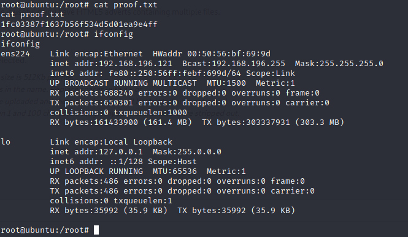

# [Conclusion]

This was a fun box and I thoroughly enjoyed the challenge. Obtaining
admin access into Wordpress was trivial, but finding a working method to
upload a shell took a little time. My basic Google search looking for
AdRotate exploits didn't turn up anything, so stumbling onto the upload
method while simply combing through the WordPress settings was exciting.
The upload function worked perfectly and once we had the initial shell,
it didn't take much longer to find a working privilege escalation. I
don't come across Wordpress websites often in my day to day job, so this
was a nice little refresher for me.

Many thanks to [SunCSR](https://www.vulnhub.com/author/suncsr-team,696/)
Team for the challenge!

# [FLAGS]

Flags are reportedly generated dynamically when the target is reset, so
the flags below will be different on each run.

  **local.txt**:   2c7434fc2ec10dfab3817484dbcbad91  
  **proof.txt**:   1fc03387f1637b56f534d5d01ea9e4ff  

# [Commands and Tools Used]

  |**Name**|**Description**|**How it was used**|
  |---|---|---|
  |[AutoRecon](https://github.com/Tib3rius/AutoRecon) |AutoRecon is a multi-threaded network reconnaissance tool which performs automated enumeration of services. It is intended as a time-saving tool for use in CTFs and other penetration testing environments (e.g. OSCP). It may also be useful in real-world engagements.   Used to do the initial enumeration discovery of the target.|
 |find |search for files in a directory hierarchy (Linux)| Used to search for executables with the SUID bit enabled for privilege escalation as root.
  |[gobuster](https://github.com/OJ/gobuster)|URI and DNS Subdomains brute force tool | Used as part of the [AutoRecon](https://github.com/Tib3rius/AutoRecon) script to brute force potential files and directories at the URI
  |[Firefox](https://firefox.com) |Web browser|Used to view the web site served on the target|
  |[php-reverse-shell.php](https://github.com/pentestmonkey/php-reverse-shell) |  php based reverse shell|Used to establish a shell to the target.|
  |[searchsploit](https://www.exploit-db.com/searchsploit) |local command line search script for exploit-db.com|Used to obtain the privilege escalation exploit source code - 45010|
  |[wpscan](https://wpscan.com) |Wordpress Security Scanner|Used to enumerate Wordpress settings and users. Also used to brute force logins.|
