# Target Information

  **Date**         04/08/2021
  ---------------- ---------------------------------------------------------
  **Name**         NoobBox 1
  **Difficulty**   Beginner
  **Location**     [Vulnhub](https://www.vulnhub.com/entry/noobbox-1,664/)
  **Author**       [Cyberheisen](https://www.twitter.com/cyberheisen)

# [Obligatory Disclaimer]

The tools and techniques described in this material are meant for
educational purposes. Their use on targets without obtaining prior
consent is illegal and it is your responsibility to understand and
follow any applicable local, state, and federal laws. Any liability
because of your actions is yours alone.

Any views and opinions expressed in this document are my own.

# [Walkthrough]

First, I need to note that for some reason, the image would not request
a DHCP address. To correct this, I added a second root level account
(root2) to the image so I could log in and execute /sbin/dhcpcd
manually. I did not use this account for any other purpose during the
course of this exercise other than to obtain an IP address.

Once I was able to access the system on my network, I ran autorecon to
enumerate the services.

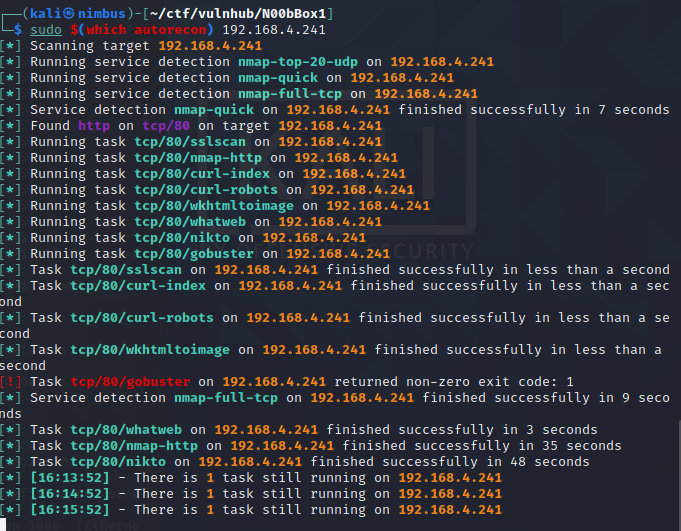 

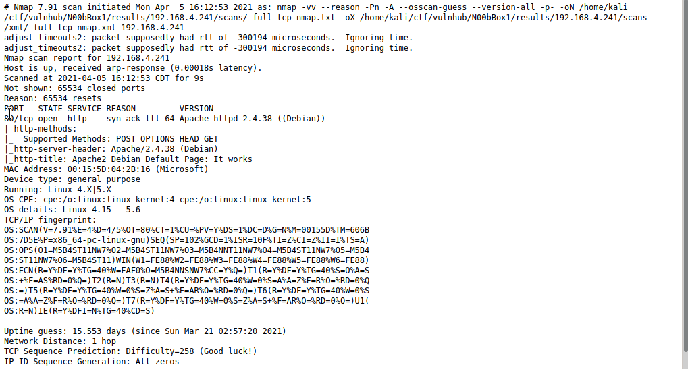 

Only a single port, 80, was available. Browsing to the address presented
us with a default Apache2 page.

 

I ran DIRB to look for any directories which may be present on the
webserver and found a WordPress site.

 

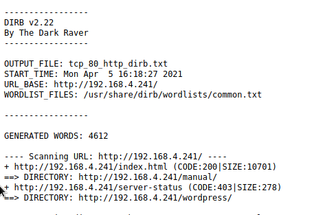

 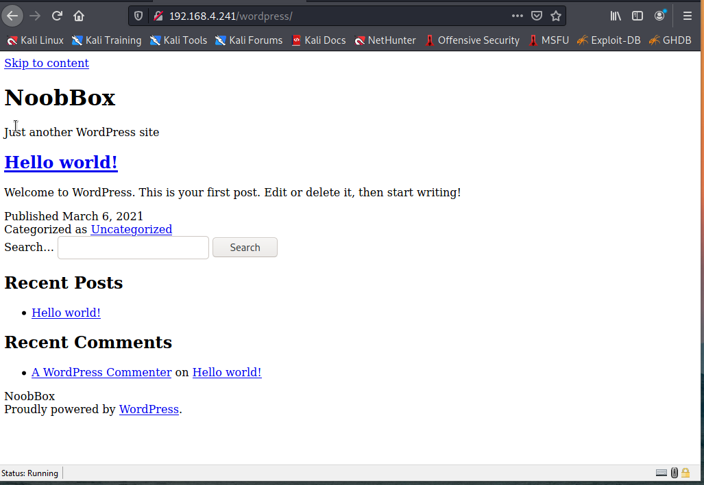

Unfortunately, the WordPress site links pointed to an unreachable
address, so the site was not rendered properly. Perhaps this was the
original address when the box was created. To get around this, I used
Burp Proxy's "Match and Replace" functionality to replace the
unreachable IP address, which the appropriate address assigned.

And that corrected the website rendering.

 

I then executed wpscan against the WordPress site, forwarded through my
Burp proxy to ensure all the links worked.

 The results were rather disappointing. A very recent version of
Wordpress, without plugins, and no known vulnerabilities.

 

 

 

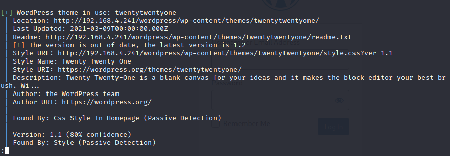

 

I spent some time investigating the xmlrpc interface, but was not
successful in getting a foothold.

My next step was to focus on the user identified. I executed wpscan
again and performed a brute force attack against the noobbox and admin
accounts using a top 1000 wordlist.

That was a no go. I then tried running the rockyou.txt wordlist. Because
of its size, I decided to focus on the noobbox account since we know
it's a valid account. However, 5 hours into the wordlist, I canceled it
since it was showing it would take days to complete.

I decided to try other wordlists and just let them run. I got super
lucky because literally the next list I tried had a hit.

 

With a potential password in hand, we tried using it to log into the
WordPress site and were able to authenticate and access the dashboard.

 

 

I tried uploading a webshell through the media upload function, but it
failed immediately.

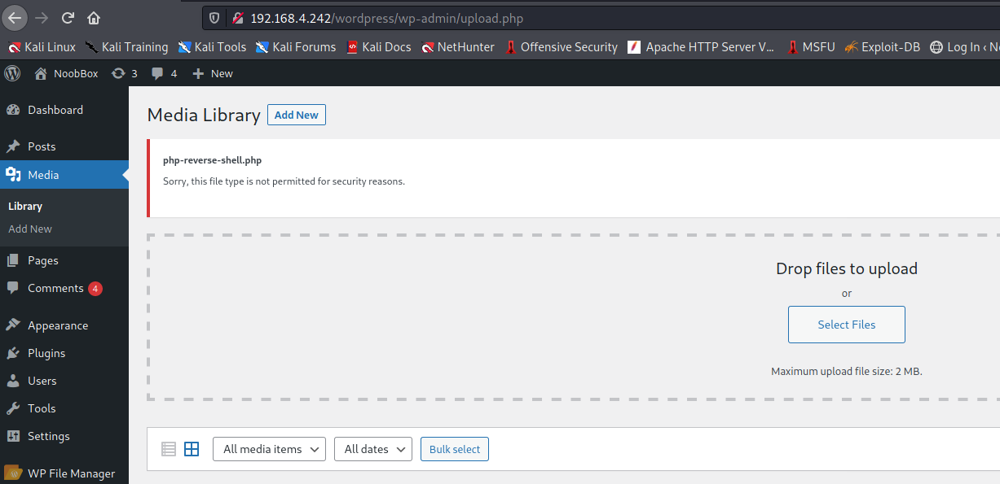

 

Since that was a bust, my next thought was perhaps finding a file
manager plugin that would allow me to upload any file to the server. I
went to the plugin configuration page and did a search for 'file'. File
Manager was the first item returned and I clicked on "Install Now"

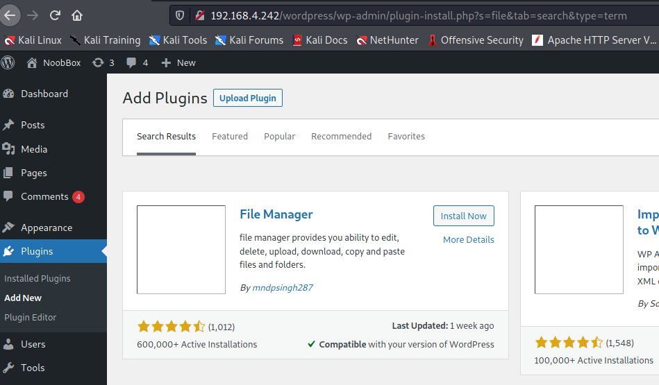

 

Once installed, I selected the option from the dashboard menu and....

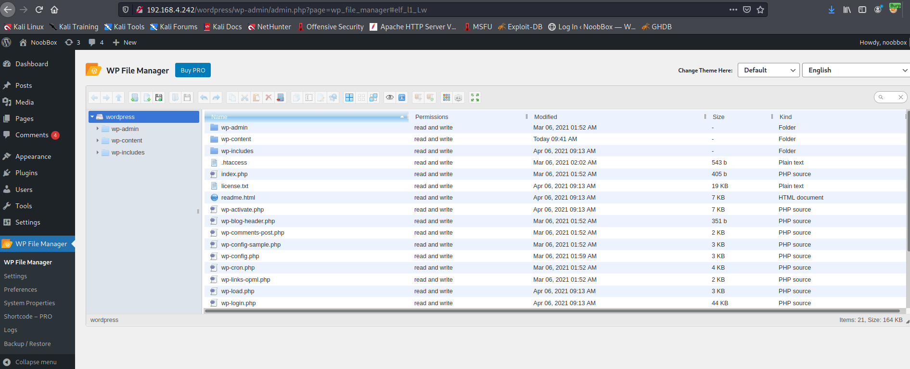

Oh yeah, this is looking promising.

We modify our webshell with the attacker source and port address.

And upload it to the server. We'll upload it to the "uploads" directory
which we know from our previous DIRB results is publicly accessible.

Let's configure our netcat listener

And we browse to our uploaded shell

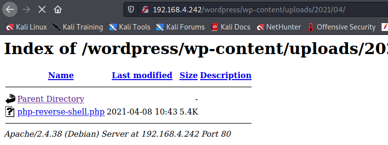

 And just like that, we have a shell and our first flag.

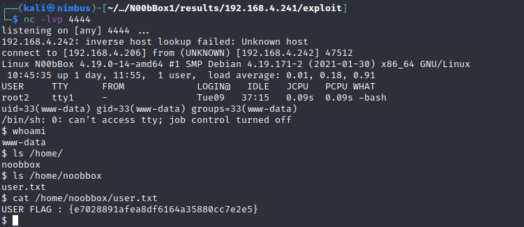

Now we move to escalate our privilege, but before we do that, let's
upgrade our shell.

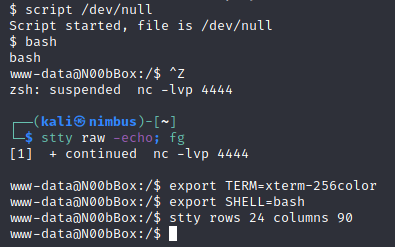

Because we\'re using zsh, we must combine the stty raw -echo command
with \'fg\' followed by hitting enter twice.

Now that we have a fancy interactive shell, let's see try to escalate
our privilege. We're running as www-data. Since we have the password for
the WordPress NoobBox user, let's try it against our Linux noobbox user.

It worked!

But now we're in a restricted shell. No worries! A simple /bin/bash
command breaks us out and into a full bash shell.

There are usually a handful of quick commands I try whenever looking for
privilege escalation. One of those is to find out whether the account
I'm using has sudo privileges. We can't view the sudoers file as
noobbox, but we can issue a sudo -l command and use our password.

 

Look at that! We\'re able to run vim.... This box is ours...

 

We do a \'sudo vim\' then execute the \'shell\' command

We have root and the flag.

 

# [Conclusion]

Getting the image to obtain an IP and then correcting the IP issues with
the WordPress site took a little time and distracted from the flag
objectives. I'm not sure if this was meant as part of the challenge or
simply leftover artifacts from the image creation, but it called into
question the integrity of the image itself and whether there was a
method available for obtaining a foothold or we were dealing with a
broken image without solution. Thankfully, there was a method, though
frustrating having to find the right wordlist to get the password, which
could have taken days. We were lucky in that the third list we used
happened to work. Once we were able to access the WordPress dashboard as
an administrator, executing a reverse shell was trivial. And getting
root on the system required executing one single command to identify the
SUDO access, so not extraordinarily difficult. As usual, I did take away
some lessons learned. First, when updating an interactive shell from a
Zshell, the stty command needs to be entered differently, or the
captured shell will not function properly. Second, don't put all my
confidence in the rockyou.txt wordlists. Use other wordlists as well.

Many thanks to [Shadow
Phreak](https://www.youtube.com/channel/UCeO0PX1ihh-Aza96P3Qs-1w) for
taking the time to put this challenge together!

# [FLAGS]

Flags are reportedly generated dynamically when the target is reset, so
the flags below will be different on each run.

  user.txt   e7028891afea8df6164a35880cc7e2e5
  ---------- ----------------------------------
  root.txt   a4c45279eaad84e5bb8ae0dfc5034400

# [Commands and Tools Used]

|**Name**|**Description**|**How it was used**|
  |---|---|---|  
  |[AutoRecon](https://github.com/Tib3rius/AutoRecon)                            |AutoRecon is a multi-threaded network reconnaissance tool which performs automated enumeration of services. It is intended as a time-saving tool for use in CTFs and other penetration testing environments (e.g. OSCP). It may also be useful in real-world engagements.|   Used to do the initial enumeration discovery of the target.|
  |[Burp Suite](https://portswigger.net/burp)                                    |Application Security Testing Software                                                                                                                                                                                                                                       |The Burp proxy functionality was used to do a match and replace of the host IP address in the WordPress pages so the site would render properly.|
  |[dirb](https://tools.kali.org/web-applications/dirb)                          |URI and DNS Subdomains brute force tool                                                                                                                                                                                                                                     |Used to brute force potential files and directories at the URI|
  |[Firefox](https://firefox.com)                                                |Web browser                                                                                                                                                                                                                                                                 |Used to view the web site served on the target|
  |[php-reverse-shell.php](https://github.com/pentestmonkey/php-reverse-shell)   |php based reverse shell                                                                                                                                                                                                                                                     |Used to establish a shell to the target.|
  |[wpscan](https://wpscan.com)                                                  |Wordpress Security Scanner                                                                                                                                                                                                                                                  |Used to enumerate Wordpress settings and users and to brute force logins.|
